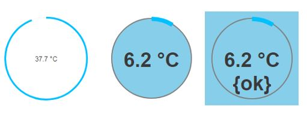
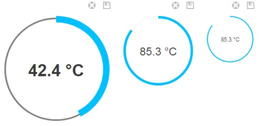
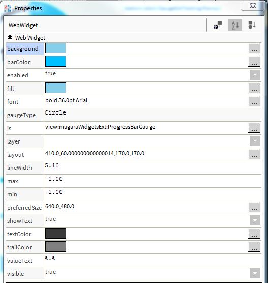

# bajaux-progressbar-example

An example that integrates the ProgressBar JavaScript library into a bajaux Web Widget.

[http://kimmobrunfeldt.github.io/progressbar.js/](http://kimmobrunfeldt.github.io/progressbar.js/)
 
[http://progressbarjs.readthedocs.io/en/latest/](http://progressbarjs.readthedocs.io/en/latest/) 

\
A 4.6 version of the bajaux-progressbar-example jar can be downloaded [here](46jar/bajauxProgressBar-ux.jar).

\
**This is an example module and as such is not supported by [Tridium](https://www.tridium.com/).**

However, it can be used as is, or as a starting point to extend and develop other widget modules.

\
 

 

## Properties

ProgressBar has a large range of parameters, a selection of which have been added as Widget properties: 

- `background`: the background colour of the widget.
- `barColor`: the colour of the gauge's bar. _(color in the ProgressBar API)_
- `fill`: the colour inside the guage. _(fill)_
- `font`: the font used by any text in the widget.
- `font`: the font used by any text in the widget.
- `gaugeType`: ProgressBar types - Line, Circle or SemiCircle.
- `lineWidth`: the width of the gauge line. _(strokeWidth)_
- `min`: the minimum gauge value, default 0.
- `max`: the maximum gauge value, default 100.
- `showText`: whether to show the widget's text.
- `valueText`: the widget's text.
- `textColor`: the colour of any text.
- `trailColor`: the colour of the trail behind the main bar. _(trailColor)_

 

 

   

